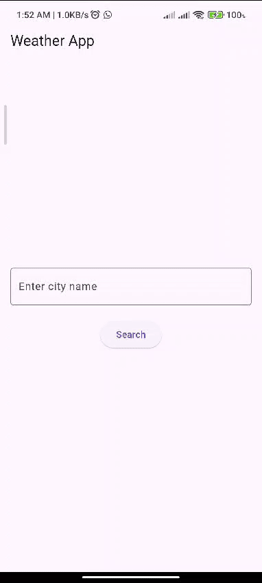

## Weather App 🌦
A Simple Flutter App to Check the Weather in Any City
This is a basic weather app built using Flutter that allows users to check the weather by typing the name of a city. It uses the WeatherAPI.com service to fetch real-time weather data like current temperature, weather conditions, and displays the min/max temperatures for the day.

## App In Action :

